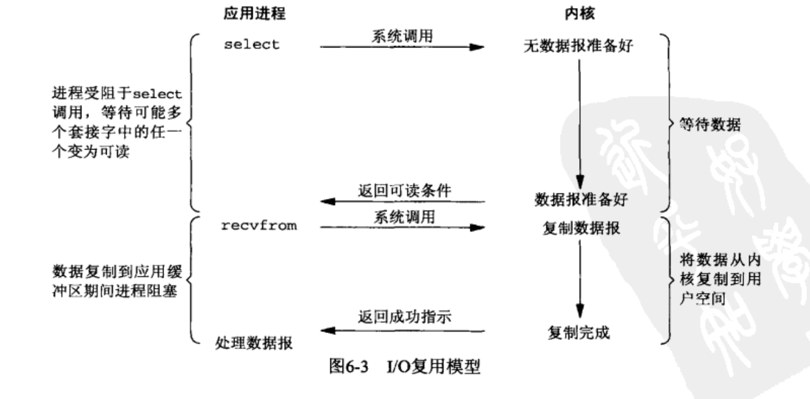
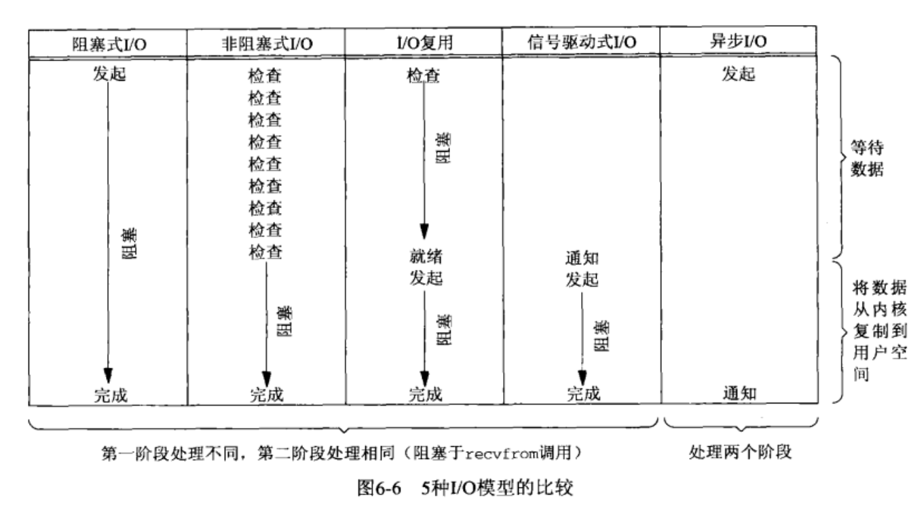
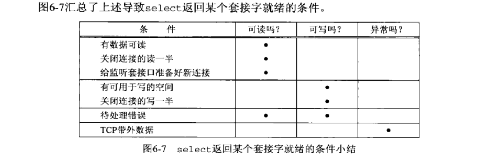
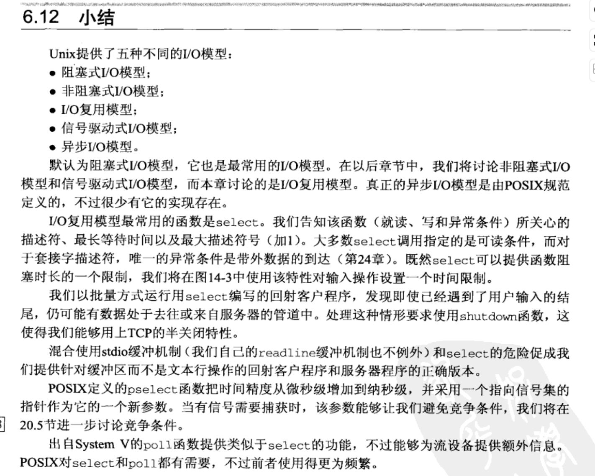

使得内核一旦发现一个或多个I/O条件就绪（也就是说输入已准备好被读取，或者描述符已能承接更多的输出），就通知进程。这个能力被称为I/O多路复用（I/O multiplexing），由select和poll这两个函数支持。


信号（signal）就是告诉某个进程发生了某个事件的通知，也被称为软件中断（software interrupt）。信号通常异步发生。可以由一个进程发给另一个进程（或自身），也可以由内核发给某个进程。
每个信号都有一个相关联的**处置（disposition）**，也称为**行为（action）**，可以通过设置sigaction函数来设置一个信号处置。

<center class ='img'>

</center>

<center class ='img'>

</center>


#### select函数
该函数允许进程指示内核等待多个事件中的任何一个发生，并只在有一个或多个事件发生或经历一段指定时候后才唤醒它。
调用select函数时，我们可告知内核对哪些描述符（读、写或异常条件）感兴趣以及等待多长时间。这些描述符不拘束于套接字描述符，任何描述符都可以使用select来测试。
```
int select(int maxfdpl, fd_set * readset, fd_set * writeset,
    fd_set * esceptset, const struct timeval * timeout)
```
1. timeout： 告知内核等待指定描述符中的任意一个就绪可花多长时间。
    1. 永远等待，可将参数设置为空指针
    2. 等待指定的一段时间，在时间内存在描述符准备好，则返回
    3. 不等待，检查指定描述符后立即返回，这种也称为轮训（polling）
2. 3个set参数是让内核检查的描述符，如果三个set都设置为空指针，那么我们就可以得到一个精准的定时器（可以参考libevent的定时器）
3. maxfdpl指定等待测试的描述符个数，值是待测试的最大描述符+1，也就是描述符[0, maxfdpl)区间的描述符都会被测试，比如我们希望测试1，4，5这3个描述符那么maxfdpl的值是6，[0, 6)内的描述符都会被测试。

这些set参数都值-结果类型，所以每次调用select函数，都要我们关心的描述符设置正确。

<center class ='img'>

</center>


#### shutdown函数
终止网络连接的通常方法是调用close函数，不过close有两个限制，我们可以使用shutdown函数避免：
1. close将描述符的引用计数减为1，仅在该计数变为0时才关闭套接字。使用shutdown可以不管引用计数就激发TCP的正常连接终止序列。
2. close终止读和写两个方向的数据传送。使用shutdown函数可以关闭单个读/写的通道。


#### pselect函数
```
int pselect(int maxfdpl, fd_set * readset, fd_set * writeset,
    fd_set * esceptset, const struct timespec * timeout, const sigset_t *sigmark)
```
sigmark：主要作用是提供一个临时的信号屏蔽集。在 pselect 函数执行时，系统会使用这个信号屏蔽集来替代当前进程的信号屏蔽集，并在函数返回后恢复原来的信号屏蔽集。这允许程序在调用 pselect 时，能够安全地更改信号屏蔽，而不会引起竞争条件或信号处理的不确定性。（1.避免竞争条件、2.原子化操作、3.信号处理的安全性）


#### poll函数
```
#include <poll.h>
int poll(struct pollfd *fdarray, unsigned long nfds, int timeout);

struct pollfd {
    int fd;         // descriptor to check
    short events;   // events of interest on fd
    short revents;  // events that occurred on fd
}
```
1. fdarray，测试的条件由events字段指定，函数在相应的revents字段返回该描述符的状态。
2. nfds，指fdarray的数组格式
3. timeout，指定poll函数返回前等待多长时间


<center class ='img'>

</center>