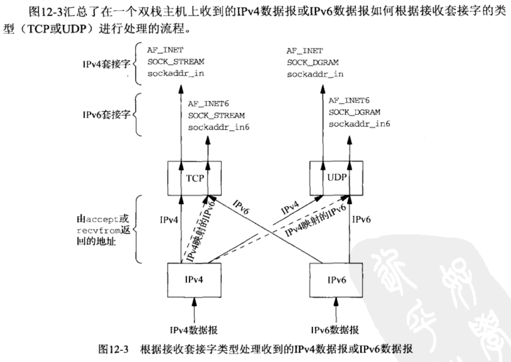
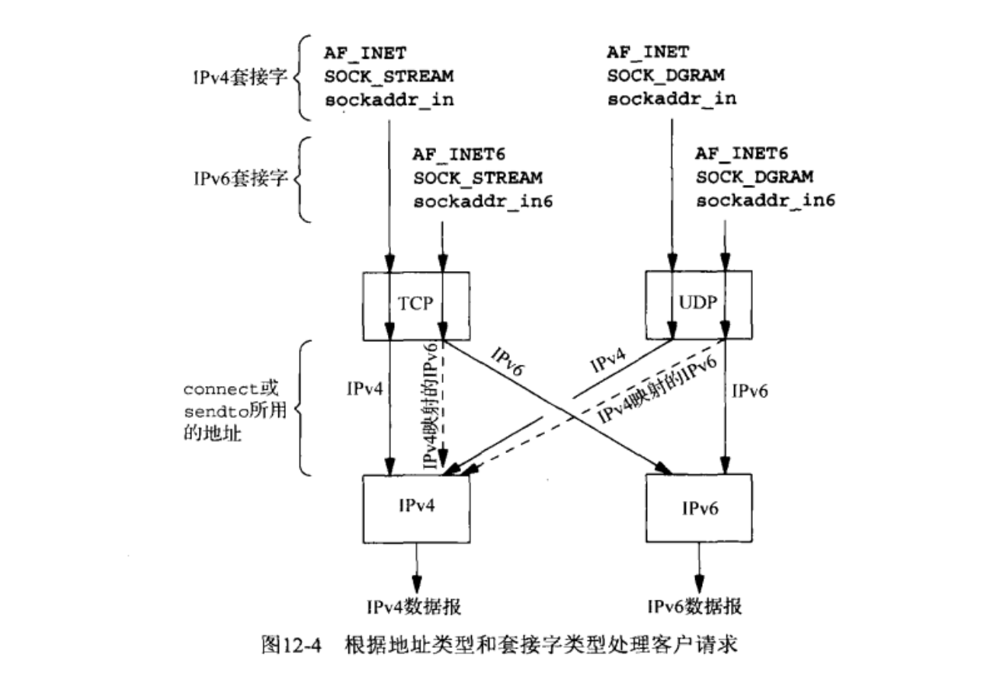
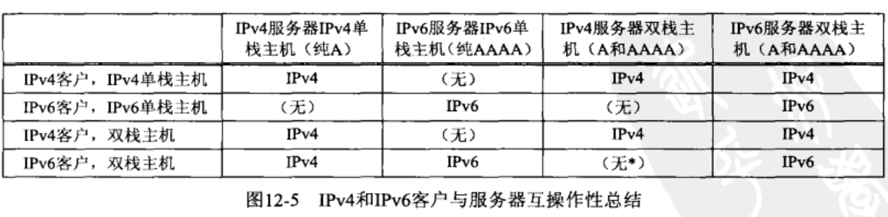

双栈主机上的IPv6服务器既能服务于IPv4客户，又能服务于IPv6客户。IPv4客户发送给这种服务器的仍然是IPv4数据报，不过服务器的协议栈会把客户主机的地址转换成一个IPv4映射的IPv6地址，因为IPv6服务器仅仅处理IPv6套接字地址结构。
类似地，双栈主机上的IPv6客户能够和IPv4服务器通信。客户的解析器会把服务器主机所有的A记录作为IPv4映射的IPv6地址返回给客户，而客户指定这些地址之一调用connect将会使双栈发送一个IPv4 SYN分节。只有少量特殊的客户和服务器需要知道对端使用的具体协议（例如FTP），而IN6_IS_ADDR_V4MAPPED宏可用于判定对端是否在使用IPv4。