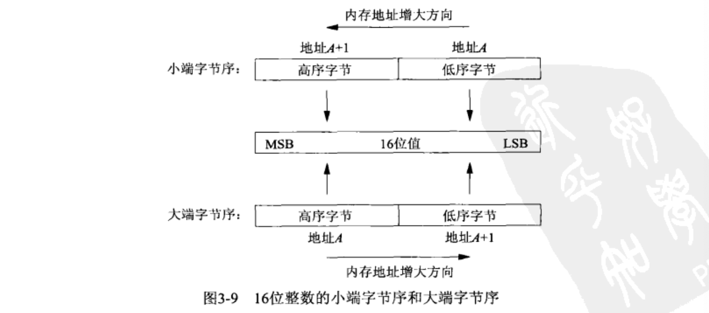

### IPv4套接字地址结构：
```
// Applications/Xcode.app/Contents/Developer/Platforms/MacOSX.platform/Developer/SDKs/MacOSX14.4.sdk/usr/include/netinet/in.h

struct in_addr {
	in_addr_t s_addr;               // __uint32_t
};

/*
 * Socket address, internet style.
 */
struct sockaddr_in {
	__uint8_t       sin_len;        // unsigned char
	sa_family_t     sin_family;     // __uint8_t  AF_INET/AF_INET6
	in_port_t       sin_port;       // __uint16_t
	struct  in_addr sin_addr;
	char            sin_zero[8];
};
```
1. sin_len: `sin_len` 字段用来指定 `sockaddr_in` 结构体的长度。其主要作用是在使用套接字函数时，如 `bind()`、`connect()`、`recvfrom()` 和 `sendto()` 等函数中，用来确保传递给这些函数的地址结构的长度与实际地址结构的长度一致。这是为了确保在进行网络通信时不会发生地址结构的截断或溢出。

    在实际编程中，当创建 `sockaddr_in` 结构体时，可以将 `sin_len` 设置为结构体的大小，这样在传递该结构体给套接字函数时，函数会使用 `sin_len` 字段的值来检查结构体的大小是否正确。如果设置了 `sin_len`，则套接字函数会首先检查该字段，然后再根据需要使用结构体的其余部分。

    需要注意的是，对于IPv4套接字编程，**通常情况下并不需要**显式地**设置**`sin_len` 字段，因为大多数套接字函数会在必要时自动处理它。不过，在某些特定的情况下（比如涉及到**路由套接字**），特别是在处理多种协议族的通用代码中，设置 `sin_len` 字段可能会更加安全和可靠。

2. 端口号在套接字地址接口中，总是以网络字节序来存储。（注意分清楚主机字节序、网络字节序）
3. sin_addr：sin_addr是一个结构而不仅仅是一个in_addr_t类型的无符号长整数，是存在历史原因的。早期的in_addr其实是一个union类型，用于兼容IPv4地址各种不同的表示方式，比如地址被划分为ABC类的时期。随着子网划分技术和无类地址编排的出现，各种地址类正在消失，所以union已经不需要了，所以将in_addr定义为仅有一个in_addr_t字段的结构。
4. sin_zero：作用是为了填充 `sockaddr_in` 结构体使其和 `sockaddr` 结构体在大小上一致。在早期的BSD套接字实现中，`sockaddr_in` 结构体用于表示IPv4的地址和端口信息，而 `sockaddr` 结构体是用于通用套接字地址的结构体。`sockaddr` 结构体的大小比 `sockaddr_in` 结构体大，为了保证类型转换的正确性，需要填充一些额外的空间，因此就有了 `sin_zero` 字段。


### 通用套接字地址结构：
```
/*
 * [XSI] Structure used by kernel to store most addresses.
 */
struct sockaddr {
	__uint8_t       sa_len;         /* total length */
	sa_family_t     sa_family;      /* [XSI] address family */
	char            sa_data[14];    /* [XSI] addr value */
};
```
作为参数传入函数时，套接字地址结构总是以引用（指针）来传递，为了兼容多协议族的套接字地址结构，传入的指针应该是一个可被解析为各个类型的指针，也就是void *这种通用指针类型，但由于定义套接字函数时，void *并未可用。所以在<sys/socket.h>定义了这个通用套接字地址结构。


### IPv6套接字地址结构：
```
/*
 * IPv6 address
 */
typedef struct in6_addr {
	union {
		__uint8_t   __u6_addr8[16];
		__uint16_t  __u6_addr16[8];
		__uint32_t  __u6_addr32[4];
	} __u6_addr;                    /* 128-bit IP6 address */
} in6_addr_t;

/*
 * Socket address for IPv6
 */
#if !defined(_POSIX_C_SOURCE) || defined(_DARWIN_C_SOURCE)
#define SIN6_LEN
#endif /* (_POSIX_C_SOURCE && !_DARWIN_C_SOURCE) */
struct sockaddr_in6 {
	__uint8_t       sin6_len;       /* length of this struct(sa_family_t) */
	sa_family_t     sin6_family;    /* AF_INET6 (sa_family_t) */
	in_port_t       sin6_port;      /* Transport layer port # (in_port_t) */
	__uint32_t      sin6_flowinfo;  /* IP6 flow information */
	struct in6_addr sin6_addr;      /* IP6 address */
	__uint32_t      sin6_scope_id;  /* scope zone index */
};
```
1. 如果操作系统支持套接字地址结构中的长度字段，则需要定义SIN6_LEN。SIN6_LEN 是一个用于表示 sockaddr_in6 结构体的大小的宏。在一些系统中，这个宏被定义为 sizeof(struct sockaddr_in6)，即 sockaddr_in6 结构体的大小。
2. IPv6的地址族是AF_INET6，IPv4的地址族是AF_INET
3. sin6_flowinfo：流标，一个字段当俩字段用。低序20位是流标（flow label）；高序12位保留。
4. sin6_scope_id：用于指定IPv6地址的范围标识符，此范围标识符用于指定该地址所处的范围或作用域。例如用于区分不同的本地链路或子网，以确保数据包被正确地发送到目标地址所在的网络范围内。范围标识符的具体含义取决于地址所处的上下文和网络配置。


#### 地址族：
地址族（Address Family）是计算机网络编程中的一个重要概念，用于指定套接字地址的类型或协议族。地址族定义了套接字地址的格式、表示方法以及套接字可以使用的网络协议。

在套接字编程中，地址族通常用于以下两个方面：

1. **指定套接字地址类型**：不同的地址族对应于不同的套接字地址类型。例如：
   - IPv4地址族（AF_INET）：用于表示IPv4地址。
   - IPv6地址族（AF_INET6）：用于表示IPv6地址。
   - UNIX域地址族（AF_UNIX）：用于表示本地UNIX域套接字地址。
   - AppleTalk地址族（AF_APPLETALK）：用于表示苹果Talk网络地址。

2. **选择通信协议**：不同的地址族通常对应于不同的通信协议。例如：
   - 在IPv4地址族（AF_INET）中，常用的通信协议是TCP和UDP。
   - 在IPv6地址族（AF_INET6）中，也可以使用TCP和UDP，但也支持一些新的IPv6专用协议。
   - 在UNIX域地址族（AF_UNIX）中，通常使用的协议是本地的UNIX域套接字协议。

地址族是在套接字创建时指定的，它决定了套接字的地址类型和使用的协议族。正确地选择地址族对于确保套接字能够正确地通信以及与其他网络设备和应用程序互操作是非常重要的。

总之，地址族是指定套接字地址类型和通信协议的一种机制，它是套接字编程中的重要概念，对于网络通信的正确性和性能至关重要。


### 新版本的通用套接字地址结构：
```
/*
 * RFC 2553: protocol-independent placeholder for socket addresses
 */
#define _SS_MAXSIZE     128
#define _SS_ALIGNSIZE   (sizeof(__int64_t))
#define _SS_PAD1SIZE (_SS_ALIGNSIZE - sizeof(__uint8_t) - sizeof(sa_family_t))
#define _SS_PAD2SIZE (_SS_MAXSIZE - sizeof(__uint8_t) - sizeof(sa_family_t) - _SS_PAD1SIZE - _SS_ALIGNSIZE)

/*
 * [XSI] sockaddr_storage
 */
struct sockaddr_storage {
	__uint8_t       ss_len;         /* address length */
	sa_family_t     ss_family;      /* [XSI] address family */
	char                    __ss_pad1[_SS_PAD1SIZE];
	__int64_t       __ss_align;     /* force structure storage alignment */
	char                    __ss_pad2[_SS_PAD2SIZE];
};
```
`sockaddr_storage` 结构的引入是为了解决套接字编程中的一个常见问题：如何处理不同类型的套接字地址。

在早期的套接字编程中，不同的网络协议和地址类型使用不同的套接字地址结构，例如 `sockaddr_in` 用于表示IPv4地址，`sockaddr_in6` 用于表示IPv6地址，`sockaddr_un` 用于表示UNIX域地址等。这种情况下，当我们编写通用的网络编程代码时，需要考虑如何处理各种不同类型的套接字地址。

引入 `sockaddr_storage` 结构的主要目的是为了提供一个通用的套接字地址结构，它可以容纳任何类型的套接字地址。通过使用 `sockaddr_storage`，我们可以在不了解套接字地址的具体类型的情况下，仍然能够安全地操作和传递套接字地址。

另外，随着网络技术的发展，新的网络协议和地址类型不断涌现，为了应对这种变化，引入一个通用的套接字地址结构是很有必要的。`sockaddr_storage` 的设计考虑了未来的扩展性，使得它可以很容易地适应新的网络协议或地址类型的加入。

因此，引入 `sockaddr_storage` 结构可以简化套接字编程中对不同类型套接字地址的处理，提高代码的可移植性和通用性，同时也为未来的扩展提供了便利。


#### 套接字地址结构传递方式取决于该结构的传递方向：
1. 从进程到内核（bind、connect、sendto）
2. 从内核到进程（accept、recvfrom、getsockname、getpeername）


### 字节序排序函数：
考虑一个16位整数，它由2个字节组成。内存中存储这两个字节有两种方法：
1. 将低序字节存储在起始地址，这称为小端（little-endian）字节序
2. 将高序字节存储在起始地址，这称为大端（big-endian）字节序
<center class ='img'>

</center>
MSB（most significant bit）: 最高有效位
LSB（least significant bit）: 最低有效位
一句话就是，表示多个字节值的哪一端（大端或小端）存储在该值的起始地址。

注意两个概念：
某个系统使用的字节序称为**主机字节序(host byte order)**。
网络协议指定了一个**网络字节序(network byte order)**。网际协议使用的**大端字节序**传输字节。
大多数网络协议规定了数据在传输过程中应该使用**网络字节序**。因此，无论计算机的本地字节序是大端还是小端，它在进行网络通信时都需要进行字节序转换，以确保数据能够被正确地解释。网络字节序通常采用大端字节序，这是为了确保在不同类型的计算机之间进行网络通信时能够正确地解释数据。

IPv4/IPv6**数值格式**和**表达格式(点分十进制数串)**之间的转换使用inet_pton和inet_ntop函数（p:presentation、n:numeric）。

请使用新函数替换就函数以兼容IPv6:

