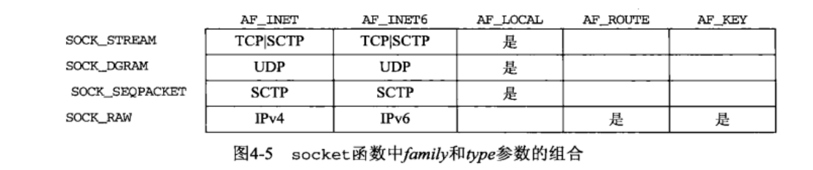
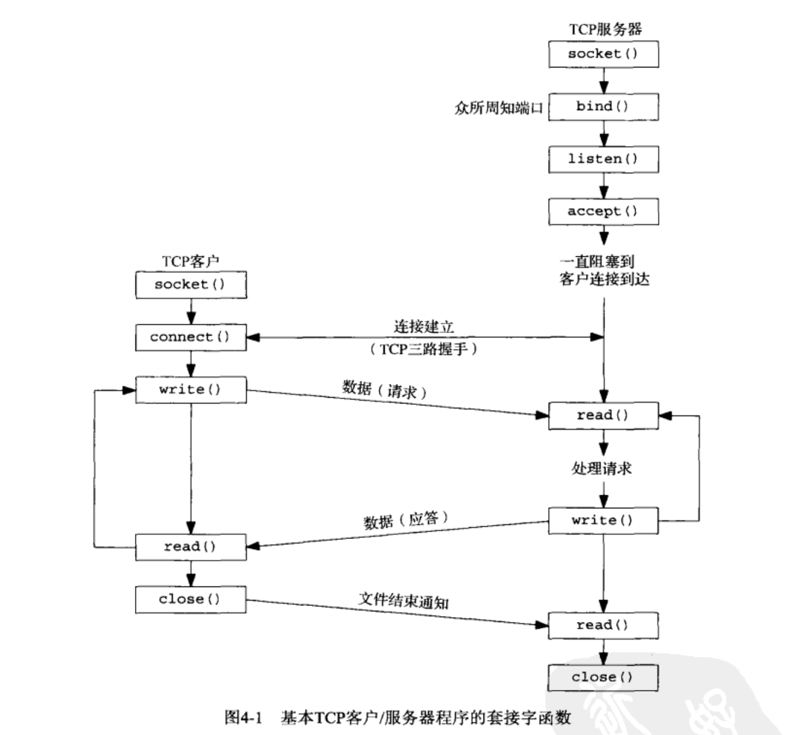
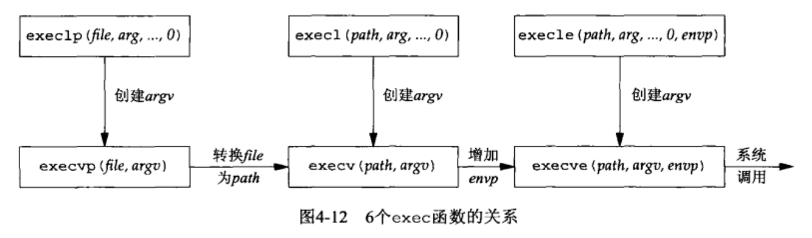

## 基本TCP套接字编程
```
#include <sys/socket.h>
int socket(int family, int type, int protocol);
// 在成功时返回一个小的非负整数值--套接字描述符(socket descriptor，简称sockfd)
```
1. family：协议组/协议域
	
2. type：指明套接字类型
3. protocol：某个协议类型的常量，或者设置为0，以选择所给定family和type组合的系统默认值。

| family   | 说明 |     
| :----- | :--: |
| AF_INET |  IPv4协议  |
| AF_INET6 |  IPv6协议  |
| AF_LOCAL |  Unix域协议  |
| AF_ROUNT |  路由套接字  |
| AF_KEY |  密钥套接字  |

| type   | 说明 |     
| :----- | :--: |
| SOCK_STREAM |  字节流套接字  |
| SOCK_DGRAM |  数据报套接字  |
| SOCK_SEQPACKET |  有序分组套接字  |
| SOCK_RAW |  原始套接字  |

| protocol   | 说明 |     
| :----- | :--: |
| IPPROTO_CP |  TCP传输协议  |
| IPPROTO_UDP |  UDP传输协议  |
| IPPROTO_SCTP |  SCTP传输协议  |
<center class ='img'>

</center>


<center class ='img'>

</center>


```
#include <sys/socket.h>
int connect(int sockfd, const sockaddr *servaddr, socklen_t addrlen);
```
2. servaddr：套接字地址结构的指针
3. addrlen：套接字地址结构的大小


<!-- TCP
若对客户的SYN响应是RST（表示复位），则表明该服务器主机在我们指定的端口上没有进程在等待与之连接（例如服务器进程也许没在运行）。这是一种硬错误（hard error），客户收到RST应当返回ECONNREFUSED错误。
 -->


```
#include <sys/socket.h>
// 把一个本地套接字地址结构赋予一个套接字
int bind(int sockfd, const sockaddr *myaddr, socklen_t addrlen);
```
常见错误EADDRINUSE（Address already in use，地址已使用）。


```
#include <sys/socket.h>
// listen函数仅由TCP服务器调用，做了两件事
// 1. 将一个未连接的套接字转换成一个被动套接字，指示内核应接受指向该套接字的连接请求。调用listen函数导致套接字由CLOSE状态转换到LISTEN状态。
// 2. 第二个参数规定了内核应该为相应套接字排队的最大连接个数。
int listen(int sockfd, socklen_t backlog);
```
backlog：TCP为监听套接字维护的两个队列
1. 未完成连接队列（incomplete connection queue），队列内的套接字均处于SYN_RCVD状态。
2. 完成连接队列（completed connection queue），每个已完成TCP三次握手过程，队列内的套接字均处于ESTABLISHED状态。
两个队列的和不超过backlog。


```
#include <sys/socket.h>
// 由TCP服务器调用，用于从已完成连接队列队头返回一个已完成连接。如果已完成连接队列为空，则进程被投入睡眠。
// 返回值是已连接套接字描述符（connected socket）
int accept(int sockfd, sockaddr *cliaddr, socklen_t *addrlen);
```
cliaddr和addrlen返回已连接的对端进程（客户）的协议地址。addrlen是**值-结果**参数。
sockfd：监听套接字描述符（listening socket fd）


fork两个经典用法“
1. 一个进程创建一个自身的副本，使得每个副本都可以在另一个副本执行其他任务的同时处理各自的某个操作。这是网络服务器的典型用法。 
2. 一个进程想要执行另一个程序。既然创建新进程的唯一办法是调用fork，该进程于是首先调用fork创建一个自身的副本，然后其中一个副本（通常子进程）调用exec把自身替换成新的程序。这是诸如shell之类程序的典型用法。

存放在硬盘的可执行程序文件能够被Unix执行的唯一方法：由一个现有程序调用六个exec函数中的一个。exec把当前进程映射替换成新的程序文件，而且该新程序通常从main函数开始执行。进程ID并不改变。我们称调用exex的进程为**调用进程(calling process)**，称新执行的程序为新程序(new program)。

<center class ='img'>

</center>


```
#include <unistd.h>
// 将该套接字标记为已关闭，使之不能再用它去调用read和wrie函数，对于正在发送的数据，则会继续发送，发送完毕后终止TCP连接。
int close(int sockfd);
```


```
#include <sys/socket.h>
// 获取本地地址，即当前套接字绑定的本地IP地址和端口号。
// AF： ADDRESS FAMILY
// return 
int getsockname(int sockfd, struct sockaddr *localaddr, socklen_t *addrlen);
// 获取远程地址，即当前套接字连接的远程IP地址和端口号。
// return：已连接套接字描述服
// peeraddr： 客户的IP地址和端口号
int getpeername(int sockfd, struct sockaddr *peeraddr, socklen_t *addrlen);
```

在网络编程中，`close` 和 `shutdown` 是用于关闭套接字（socket）连接的两个函数，但它们的功能和使用场景有所不同。

##### `close`
- **功能**：`close` 函数用于关闭一个套接字，并释放与该套接字相关的所有资源。
- **作用**：当调用 `close` 时，套接字描述符会被标记为可重用，并且与该描述符关联的资源会被回收。如果该套接字是一个连接套接字，`close` 还会终止该连接。
- **影响**：`close` 函数会立即关闭套接字，无论是否还有未发送的数据。这可能导致未发送的数据丢失。
- **示例**：
  ```c
  close(socket_fd);
  ```

##### `shutdown`
- **功能**：`shutdown` 函数用于部分或全部关闭一个套接字的连接。它允许你分别关闭套接字的读、写或读写操作。
- **作用**：`shutdown` 提供了更细粒度的控制，可以指定只关闭读取操作、只关闭写入操作或同时关闭两者。
- **影响**：调用 `shutdown` 不会立即释放套接字描述符，它只是终止套接字的某些操作。你仍需要调用 `close` 来释放套接字描述符和相关资源。
- **参数**：
  - `SHUT_RD`：关闭套接字的读操作。套接字不能再接收数据。
  - `SHUT_WR`：关闭套接字的写操作。套接字不能再发送数据。此操作会发送一个FIN包，表示发送方已经完成数据发送。
  - `SHUT_RDWR`：同时关闭套接字的读和写操作。
- **示例**：
  ```c
  shutdown(socket_fd, SHUT_WR);
  ```

##### 总结
- `close`：完全关闭套接字，并释放所有资源。适用于不再需要使用该套接字的情况。
- `shutdown`：部分关闭套接字的连接，可以选择关闭读、写或读写操作。适用于需要逐步终止通信的情况，比如在TCP连接中先发送FIN包以优雅地关闭连接。

##### 使用场景
- **使用 `close`**：当你确定不会再使用该套接字，并希望立即释放资源时使用。例如，在程序结束时关闭所有打开的套接字。
- **使用 `shutdown`**：当你希望优雅地关闭一个连接，确保对方收到所有数据并知晓连接将要终止时使用。例如，在完成数据发送后，通过 `shutdown(socket_fd, SHUT_WR)` 通知对方不再发送数据，但仍可以接收对方的数据。