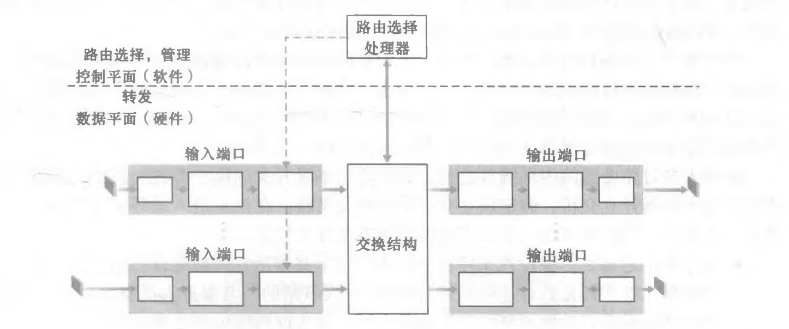
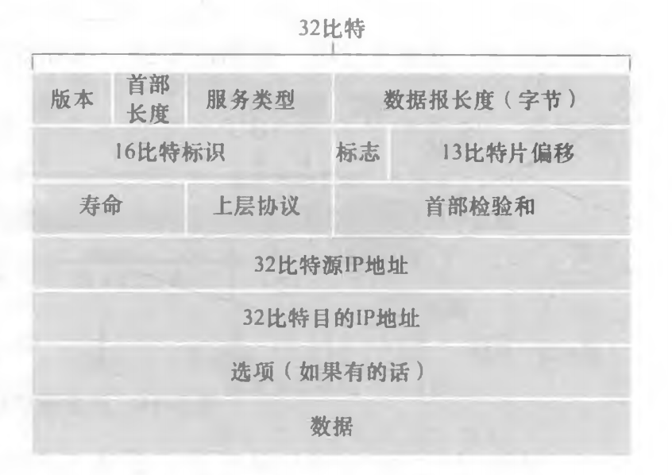
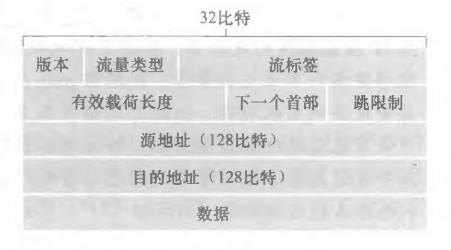
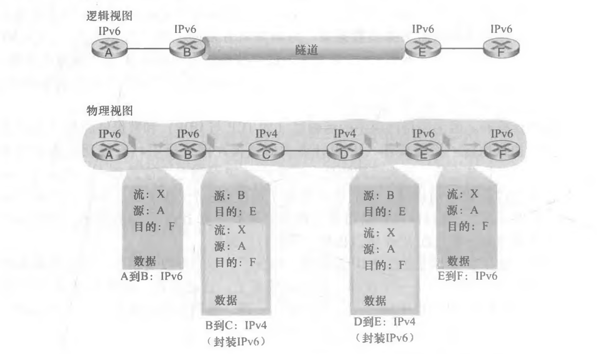

网络层的数据平面功能，即网络层中每台路由器的功能，该数据平面功能决定到达路由器输入链路之一的数据报（即网络层的分组）如何转发到该路由器的输出链路之一。

转发和路由选择：数据平面和控制平面：
网络层的作用从表面上看极为简单，即将分组从一台发送主机移动到一台接收主机。为此，需要使用两种重要的网络层功能：
 1. 转发。当一个分组到达某路由器的一条输入链路时，该路由器必须将该分组移动到适当的输出链路。平面中实现的唯一功能（尽管是最为常见和重要的功能）。在最为常见的场合，分组也可能被现有的路由器阻挡（例如，该分组来源于一个已知的恶意主机，或者该分组发向一个被禁止的目的主机），或者可能是冗余的并经过多条出链路发送。
 2. 路由选择。当分组从发送方流向接收方时，网络层必须决定这些分组所采用的路由或路径。计算这些路径的算法被称为路由选择算法(routing algorithm)。路由选择在网络层的控制平面中实现

 - **转发(forwarding)** 是指将分组从一个输入链路接口转移到适当的输出链路接口的路由器本地动作。转发发生的时间尺度很短(通常为几纳秒)，因此通常用硬件来实现。
 - **路由选择(routing)** 是指确定分组从源到目的地所采取的端到端路径的网络范围处理过程。路由选择发生的时间尺度长得多(通常为几秒)，因此通常用软件来实现。

 每台网络路由器中有一个关键元素----它的转发表(forwarding table)。路由器检査到达分组首部的一个或多个字段值，进而使用这些首部值在其转发表中索引，通过这种方法来转发分组。这些值对应存储在转发表项中的值，指出了该分组将被转发的路由器的输出链路接口。

约定术语**分组交换机**是指一台通用分组交换设备，它根据分组首部字段中的值，从输入链路接口到输出链路接口转移分组。

分组交换机类型：
1. **链路层交换机（link layer switch）**，基于**链路层帧**中的字段值做出转发决定。链路层交换机因此是链路层（第2层）设备。
2. **路由器（router）**，基于**网络层数据报**中的首部字段值做岀转发决定。路由器因此是网络层（第3层）设备

### 路由器工作原理

路由器的输入端口、输出端口和交换结构几乎总是用硬件实现。这里的“端口” 一词，指的是路由器的物理输入和输出接口。
- **输入端口（input port）**：
    1. 终结了入物理链路的物理层功能
    2. 与位于入链路远端的数据链路层交互来执行数据链路层功能
    3. 在输入端口执行查找功能,通过查询转发表决定路由器的输出端口，到达的分组通过路由器的交换结构转发到输出端口。
    4. 控制分组（如携带路由选择协议信息的分组）从输入端口转发到路由选择处理器。

- **交换结构**：
    1. 将路由器的输入端口连接到它的输岀端口。这种交换结构完全包含在路由器之中，即它是一个网络路由器中的网络!

- **输出端口**：输出端口存储从交换结构接收的分组，并通过执行必要的链路层和物理层功能在输出链路上传输这些分组。当一条链路是双向的时（即承载两个方向的流量），输出端口通常与该链路的输入端口成对出现在同一线路卡上。

- **路由选择处理器**：路由选择处理器执行控制平面功能。在传统的路由器中，它执行路由选择协议，维护路由选择表与关联链路状态信息，并为该路由器计算转发表。在SDN路由器中，路由选择处理器（在其他活动中）负责与远程控制器通信，目的是接收由远程控制器计算的转发表项，并在该路由器的输入端口安装这些表项。

### 网际协议：IPv4、寻址、IPv6及其他
#### IPv4数据报格式

- 版本（号）：这4比特规定了数据报的IP协议版本。通过查看版本号，路由器能够确定如何解释IP数据报的剩余部分。不同的IP版本使用不同的数据报格式
- 首部长度：因为一个IPv4数据报可包含一些可变数量的选项（这些选项包括在IPv4数据报首部中），故需要用这4比特来确定IP数据报中载荷实际开始的地方。
- 服务类型：服务类型（TOS）比特，包含在IPv4首部中，以便使不同类型的IP数据报（例如，一些特别要求低时延、高吞吐量或可靠性的数据报）能相互区别开来。例如，将实时数据报（如用于IP电话应用）与非实时流量（如FTP）区分开也许是有用的。提供特定等级的服务是一个由网络管理员对路由器确定和配置的策略问题。
- 数据报长度：IP数据报的总长度（首部加上数据），以字节计。因为该字段长为16比特，所以IP数据报的理论最大长度为65535字节。然而，数据报很少有超过1500字节的，该长度使得IP数据报能容纳最大长度以太网帧的载荷字段。
- 标识、标志、片偏移：这三个字段与所谓IP分片有关，这是一个我们将很快要考虑的主题。新版本的IP （即IPv6）不允许在路由器上对分组分片。
- 寿命（Time To Live, TTL）：用来确保数据报不会永远（如由于长时间的路由选择环路）在网络中循环。每当一台路由器处理数据报时，该字段的值减1，若TTL字段减为0，则该数据报必须丢弃。
- 协议：通常仅当一个IP数据报到达其最终目的地时才会用到。该字段值指示了IP数据报的数据部分应交给哪个特定的运输层协议。例如，值为6表明数据部分要交给TCP,而值为17表明数据要交给UDP 对于所有可能值的列表，参见[IANA Protocol Numbers 2016 ]。注意在IP数据报中的协议号所起的作用，类似于运输层报文段中端口号字段所起的作用。协议号是将网络层与运输层绑定到一起的黏合剂，而端口号是将运输层和应用层绑定到一起的黏合剂。
- 首部检验和：首部检验和用于帮助路由器检测收到的IP数据报中的比特错误。注意到在IP层只对IP首部计算了检验和，而TCP/UDP检验和是对整个TCP/UDP报文段进行的。
- 源和目的IP地址：
- 选项：选项字段允许IP首部被扩展。还因为有些数据报要求处理选项，而有些数据报则不要求，故导致一台路由器处理一个IP数据报所需的时间变化可能很大。这些考虑对于高性能路由器和主机上的IP处理来说特别重要。由于这样或那样的原因，在IPv6首部中已去掉了IP选项。
- 数据（有效载荷）：

一个链路层帧能承载的最大数据量叫作最大传送单元（Maximum Transmission Unit, MTU）。发送方与目的地路径上的每段链路可能使用不同的链路层协议，因此每种协议可能具有不同的MTU。

#### IPv4 编址

IP地址按**点分十进制记法（dotled decimal notation）** 书写。

#### IPv6

<!-- - 扩大的地址容量：IPv6将IP地址长度从32比特增加到128比特。
- 简化高效的40字节首部：40字节定长首部允许路由器更快地处理IP数据报。一种新的选项编码允许进行更灵活的选项处理。
- 流标签：该字段可用于“给属于特殊流的分组加上标签，这些特殊流是发送方要求进行特殊处理的流，如一种非默认服务质量或需要实时服务的流”。 -->

- 版本：该4比特字段用于标识IP版本号。IPv6将该字段值设为6。
- 流量类型：该8比特字段与我们在IPv4中看到的TOS字段的含义相似。
- 流标签：该20比特的字段用于标识一条数据报的流，能够对一条流中的某些数据报给出优先权，或者它能够用来对来自某些应用（例如IP话音）的数据报给岀更高的优先权，以优于来自其他应用（例如SMTP电子邮件）的数据报。
- 有效载荷长度：该16比特值作为一个无符号整数，给出了IPv6数据报中跟在定长的40字节数据报首部后面的字节数量。
- 下一个首部：该字段标识数据报中的内容（数据字段）需要交付给哪个协议（如TCP或UDP）。该字段使用与IPv4首部中**协议**字段相同的值
- 跳限制：转发数据报的每台路由器将对该字段的内容减1。如果跳限制计数达到0,则该数据报将被丢弃。
- 源地址和目的地址
- 数据。这是IPv6数据报的有效载荷部分。当数据报到达目的地时，该有效载荷就从IP数据报中移出，并交给在**下一个首部**字段中指定的协议处理

当前在实践中已经得到广泛采用的IPv4到IPv6迁移的方法包括建**隧道（tunneling）**。

建隧道依据的基本思想如下：假定两个IPv6节点（如图中的B和E）要使用IPv6数据报进行交互，但它
们是经由中间IPv4路由器互联的。我们将两台IPv6路由器之间的中间IPv4路由器的集合称为一个隧道（tunnel）。借助于隧道，在隧道发送端的IPv6节点（如B）可将整个IPv6数据报放到一个IPv4数据报的数据（有效载荷）字段中。于是，该IPv4数据报的地址设为指向隧道接收端的IPv6节点（在此例中为E）,再发送给隧道
中的第一个节点（在此例中为C） 隧道中的中间IPv4路由器在它们之间为该数据报提供路由，就像对待其他数据报一样，完全不知道该IPv4数据报自身就含有一个完整的IPv6数据报。隧道接收端的IPv6节点最终收到该IPv4数据报（它是该IPv4数据报的目的地），并确定该IPv4数据报含有一个IPv6数据报（通过观察在IPv4数据报中的协议
号字段是41 [RFC 4213],指示该IPv4有效载荷是IPv6数据报），从中取出IPv6数据报，然后再为该IPv6数据报提供路由，就好像它是从一个直接相连的IPv6邻居那里接收到该IPv6数据报一样。（聪明！

---
OpenFlow 是一种网络协议和架构，旨在实现可编程的网络控制。它允许网络管理员通过中央控制器（Controller）来管理网络中的数据流，并在网络设备上执行特定的转发行为。

具体来说，OpenFlow 将网络交换机（Switch）和路由器（Router）的数据转发平面（Data Plane）和控制平面（Control Plane）分离开来，通过网络设备上的流表（Flow Table）来控制数据包的转发。

OpenFlow 的基本工作原理如下：
1. 数据流转发：当网络设备收到数据包时，它会根据预先配置的流表来决定如何转发数据包。流表中包含了匹配规则（如源 IP 地址、目标 IP 地址、协议类型等）和对应的转发动作（如转发到特定端口、丢弃等）。
2. 中央控制器：OpenFlow 网络中通常会有一个中央控制器，负责管理网络中的流表和流表项。控制器与网络设备之间通过 OpenFlow 协议进行通信，控制器可以向网络设备发送配置命令，更新流表项。
3. 可编程性：OpenFlow 允许网络管理员根据实际需求编写和部署自定义的控制逻辑，实现对网络行为的灵活控制。这种可编程性使得网络可以根据应用需求进行动态调整和优化。

OpenFlow 技术的应用包括网络虚拟化、SDN（Software Defined Networking）、流量工程、网络监控等领域。它为网络管理和应用开发提供了更高的灵活性和可编程性，推动了网络架构的创新和发展。

---

涉及传统的IP转发（其中转发基于数据报的目的地址进行）和通用转发（其中转发和其他功能可以使用数据报首部中的几个不同的字段值来进行）

---
---
---
---
---

将涉及传统的IP转发（其中转发基于数据报的目的地址）和通用的转发（其中可以使用数据报首部中的几个不同域的值执行转发和其他功能）。

学习IPv4和IPv6协议及其寻址。

每台路由器的数据平面的主要作用是从其输入链路向其输出链路转发数据报；控制平面的主要作用是协调这些本地的每路由器转发动作，使得数据报沿着源和目的地主机之间的路由器路径最终进行端到端传送。