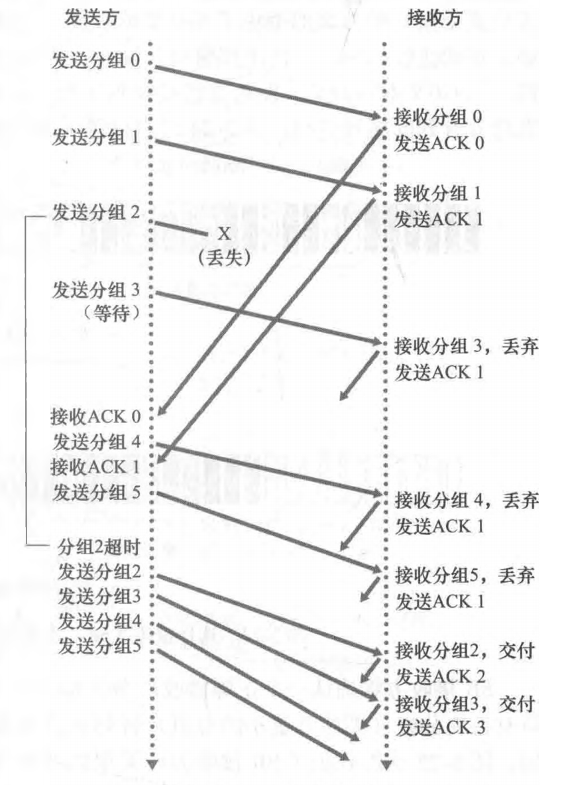
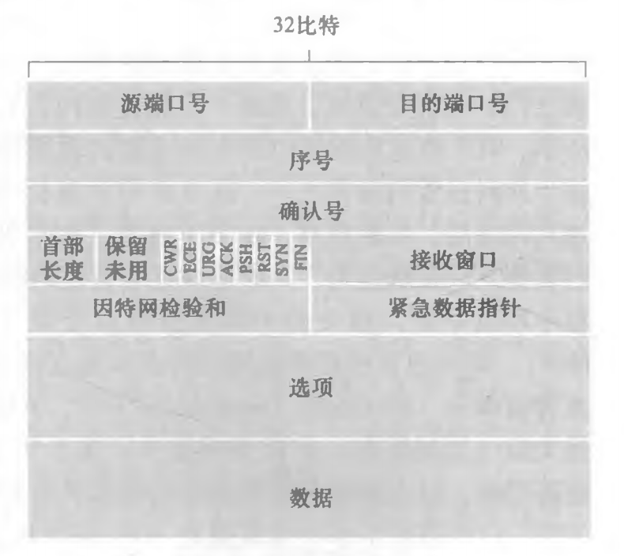
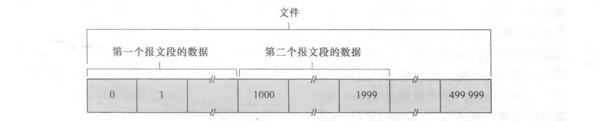
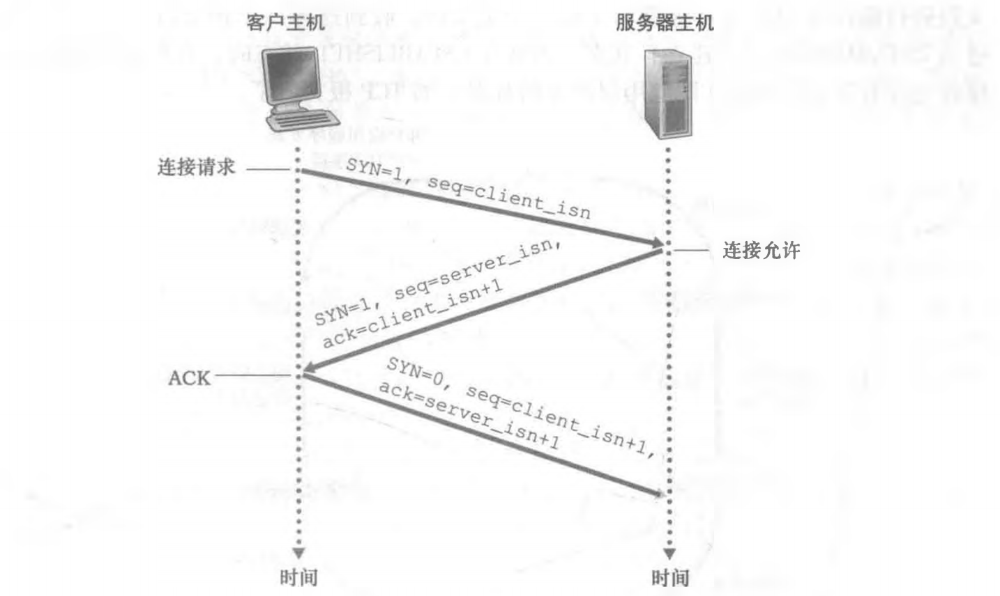
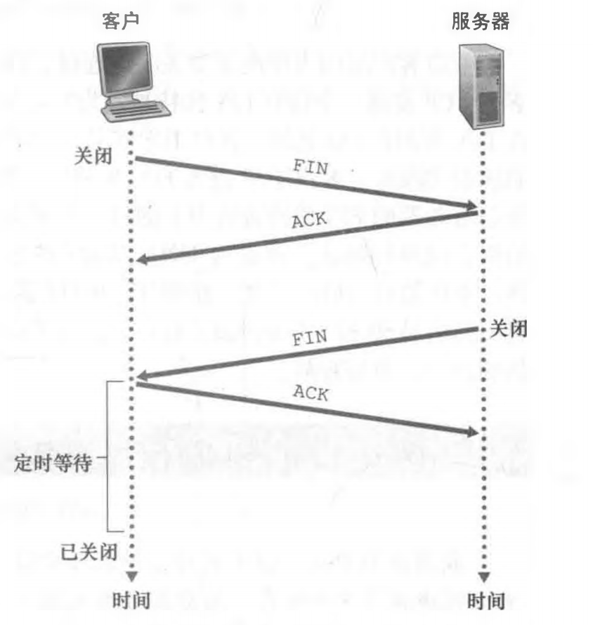
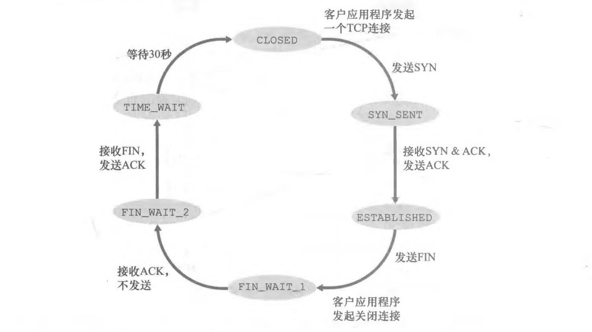
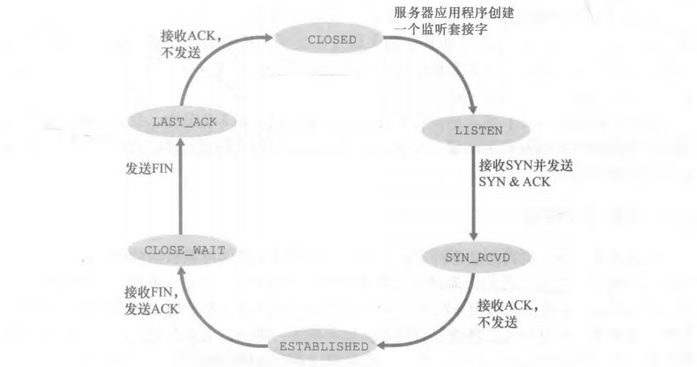

# 运输层


网络层提供了主机之间的**逻辑通信（logic communication）**，而运输层为运行在不同主机上的进程之间提供了**逻辑通信**。

运输层协议只工作在端系统（end system）中。在端系统中，运输层协议将来自应用进程的报文移动到网络边缘（即网络层），反过来也是一样，但对有关这些报文在网络核心如何移动并不作任何规定。

### 多路复用和多路分解
UDP和TCP最基本的责任是，将两个**端系统间IP的交付服务**扩展为运行在端系统上的两个**进程之间的交付服务**。将主机间交付扩展到进程间交付被称为运输层的多路复用 (transport-layer multiplexing)与多路分解(demultiplexing) 。

运输层的多路复用与多路分解，也就是将由网络层提供的主机到主机交付服务延伸到为运行在主机上的应用程序提供进程到进程的交付服务。

多路复用与多路分解服务是所有计算机网络都需要的。

将运输层报文段中的数据交付到正确的套接字的工作称为多路分解(demultiplexing) 在源主机从不同套接字中收集数据块，并为每个数据块封装上首部信息(这将在以后用于分解)从而生成报文段，然后将报文段传递到网络层，所有这些工作称为多路复用(multiplexing) 值。

多路复用要求：①套接字有唯一标识符；②每个报文段有特殊字段来指示该报文段所要交付到的套接字。（这些特殊
字段是源端口号字段(source port number field)和目的端口号字段(destination port number field)


### UDP

UDP只做运输协议能够做的最少工作。除了复用/分解功能及少量的差错检测外，它几乎没有对IP增加别的东西。

优点：
1. 应用层可精细控制发送时机，无拥塞控制
2. 无连接建立：发送方和接收方的运输层实体之间没有握手（比如TCP的三次握手）就能互发报文段。
3. 无连接状态：
4. 分组首部开销少：每个TCP报文段至少有20字节的首部开销，而UDP仅有8字节的开销。

应用层协议自实现可靠性：
谷歌的Chrome浏览器中的QUIC协议

结构：UDP首部只有4个字段，每个字段由两个字节组成。（源端口号、目的端口号、长度、检验和


### 可靠数据传输原理

可靠数据传输协议（reliable data transfer protocol）：


自动重传请求(Automatic Repeat reQuest， ARQ)协议：有三种协议功能用于检查存在比特差错的情况。
1. 差错检测：使用差错检测和纠错技术检测并可能纠正分组中的比特差错
2. 接收方反馈：接收方提供明确的反馈信息给发送方的"肯定确认"(ACK)和"否定确认"(NAK)
3. 重传：接收方收到有差错的分组时，发送方将重传该分组文

ACK: positive acknowledgment 肯定确认
NAK: negative acknowledgment 否认确定

分组重传发生情况：分组丢失、分组受损，校验出错、收到应答超时

停等(stop and-wait)协议：当发送方处于等待ACK或NAK的状态时，发送方将不会发送一块新数据，除非发送方确信接收方已正确接收当前分组，具有这种行为的协议。

发送方发送多个分组而无须等待确认，这种技术被称为流水线（pipelining），这种技术会带来更大的挑战是数据传输协议如何处理丢失、损坏及延时过大的分组。解决流水线的差错恢复有两种基本方法是：回退N步（Go Back N， GBN）和选择重传(Selective Repeat， SR)

#### 回退N步
回退N步：允许发送方发送多个分组（当有多个分组可用时）而不需等待确认，但它也受限于在流水线中未确认的分组数不能超过某个最大允许数N。


如上图那些已被发送但还未被确认的分组的许可序号范围可以被看成是一个在序号范围内长度为N的窗口。随着协议的运行，该窗口在序号空间向前滑动。因此，N常被称为窗口长度（window size） ， GBN协议也常被称为滑动窗口协议（sliding-window protocol）。

GBN发送方必须响应三种类型的事件：
1. 上层的调用：发送方检查发送窗口是否已满，如果未满，则产生一个分组并将其发送，并相应地更新变量。如果已满，发送方将数据告知上层该窗口已满。然后上层可能会过一会儿再试。
2. 收到一个ACK：GBN协议中使用累计确认：cumulative acknowledgment 表明接收方已正确接收到序号为n的以前包括n在内的所有分组。
3. 超时事件：如果出现超时，发送方重传所有已发送但还未被确认过的分组。

<center class ='img'>

</center>

上图给岀了窗口长度为4个分组的GBN协议的运行情况。因为该窗口长度的限制，发送方发送分组0~3，然后在继续发送之前，必须等待直到一个或多个分组被确认。当接收到每一个连续的ACK （例如ACK 0和ACK 1）时，该窗口便前滑动，发送方便可以发送新的分组（分别是分组4和分组5）。在接收方，分组2丢失，因此分组3、4和5被发现是失序分组并被丢弃，因此开始了重传动作。

缺点：存在性能问题，尤其是当窗口长度和带宽时延积都很大时，在流水线中会有很多分组更是如此。单个分组的差错就能够引起GBN重传大量分组，许多分组根本没有必要重传。

#### 选择重传
选择重传：通过让发送方仅重传那些它怀疑在接收方出错（即丢失或受损）的分组而避免了不必要的重传。


可靠数据传输机制及其用途的总结：
|  机制  | 说明 | 
| :----- | -------: |
|检验和 | 用于检测在一个传输分组中的比特错误| 
|定时器 |	用于超时/重传一个分组，可能因为该分组（或其AGK）在信道中丢失了。由于当一个分组延时但未丢失（过早超时），或当一个分组已被接收方收到但从接收方到发送方的ACK丢失时，可能产生超时事件，所以接收方可能会收到一个分组的多个冗余副本|
|序号| 用于为从发送方流向接收方的数据分组按顺序编号。所接收分组的序号间的空隙可使接收方检测出丢失的分组。具有相同序号的分组可使接收方检测岀一个分组的冗余副本|
| 确认 | 接收方用于告诉发送方一个分组或一组分组已被正确地接收到了。确认报文通常携带着被确认的分组或多个分组的序号。确认可以是逐个的或累积的，这取决于协议| 
| 否定确认| 接收方用于告诉发送方某个分组未被正确地接收。否定确认报文通常携带着未被正确接收的分组的序号| 
| 窗口、流水线| 发送方也许被限制仅发送那些序号落在一个指定范围内的分组。通过允许一次发送多个分组但未被确认，发送方的利用率可在停等操作模式的基础上得到增加。我们很快将会看到，窗口长度可根据接收方接收和缓存报文的能力、网络中的拥塞程度或两者情况来进行设置| 


### TCP（面向连接 connection oriented）

TCP是因特网运输层的面向连接的可靠的运输协议。TCP是非常复杂的，它涉及了连接管理、流量控制、往返时间估计以及可靠数据传送。

TCP可靠数据传输构件时遇到的所有技术包括使用序号、累积确认、检验和以及超时/重传操作（差错检测、重传、累积确认、定时器以及用于序号和确认号的首部字段），也就是**差错控制**。

TCP连接的组成包括：一台主机上的缓存、变量和与进程连接的套接字，以及另一台主机上的另一组缓存、变量和与进程连接的套接字。

一个报文段的最大长度：首部数据长度 + 最大报文段长度（Maximum Segment Size, MSS）。MSS通常根据最初确定的由本地发送主机发送的最大链路层帧长度（即所谓的最大传输单元（Maximum Transmission Unit， MTU））来设置的。（MSS是指在报文段里应用层数据的最大长度，而不是指包括首部的TCP报文段的最大长度）

报文段结构：
<center class ='img'>

</center>

- 32比特的序号字段(sequence number field)：实现可靠数据传输服务
- 32比特的确认号字段(acknowledgment number field)：实现可靠数据传输服务
- 16比特的接收窗口字段(receive window field)：用于流量控制
- 4比特的首部长度字段(header length field)：指示了以32比特的字为单位的TCP首部长度。由于TCP选项字段的原因，TCP首部的长度是可变的。(通常，选项字段为空，所以TCP首部的典型长度是20字节。
- 选项字段(options field)是可选与变长的：用于发送方与接收方协商最大报文段长度(MSS)时，或在高速网络环境下用作窗口调节因子时使用。首部字段中还定义了一个时间戳选项。
- 6比特的标志字段(flag field)：
    - ACK比特用于指示确认字段中的值是有效的，即该报文段包括一个对已被成功接收报文段的确认（捎带
    - **RST、SYN和FIN比特用于连接建立和拆除**
    - CWR和ECE比特是拥塞控制和拥塞避免相关的标志位
    - (在实践中，PSH URG和紧急数据指针并没有使用）-----------------------------------
    - ~~当PSH比特被置位时，就指示接收方应立即将数据交给上层~~
    - ~~URG比特用来指示报文段里存在着被发送端的上层实体置为“紧急”的数据~~
    - ~~紧急数据的最后一个字节由16比特的紧急数据指针字段(urgent data pointer field)指出。当紧急数据存在并给出指向紧急数据尾指针的时候，TCP必须通知接收端的上层实体。(在实践中，PSH URG和紧急数据指针并没有使用。为了完整性起见，我们才提到这些字段。)~~
    1. CWR: Congestion Window Reduced，表示拥塞窗口减小。
    1. ECE: Explicit Congestion Notification Echo，表示显式拥塞通知回显。
    1. URG: Urgent，表示紧急指针。
    1. ACK: Acknowledgment，表示确认。
    1. PSH: Push，表示推送。
    1. RST: Reset，表示连接重置。
    1. SYN: Synchronize，表示同步序列号。
    1. FIN: Finish，表示结束连接。


##### 序号字段、确认号字段:
TCP报文段首部中两个最重要的字段。是TCP可靠传输服务的关键部分。

一个报文段的序号(sequence number for a segment)是该报文段的**数据**部分，也就是字节流的首字节编号。如下图，此数据流由一个包含500 000字节的文件组成，其MSS为1000字节，数据流的首字节编号是0。


**主机A填充进报文段的确认号是主机A期望从主机B收到的下一字节的序号。**
假设主机A已收到一个来自主机B的包含字节0 ~535的报文段，以及另一个包含字节900〜1000的报文段。由于某种原因，主机A还没有收到字节536-899的报文段。在这个例子中，主机A为了重新构建主机B的数据流，仍在等待字节536 （和其后的字节）。因此，A到B的下一个报文段将在确认号字段中包含536。因为TCP只确认该流中至第一个丢失字节为止的字节，所以TCP被称为提供**累积确认（cumulative acknowledgment）**。

值得注意的是，对客户到服务器的数据的确认被装载在一个承载服务器到客户的数据的报文段中；这种确认被称为是被**捎带（piggybacked）**在服务器到客户的数据报文段中的。（把对对边消息的ACK应答和响应信息合并在同一个包的情况被称为捎带(piggybacked)，达到的效果就是节省单独发ACK包的流量。）

**流量控制**服务(flow control service)：
- 消除发送方使接收方缓存溢岀的可能性。流量控制因此是一个速度匹配服务，即发送方的发送速率与接收方应用程序的读取速率相匹配。
- TCP通过让发送方维护一个称为接收窗口(receive window)的变量来提供流量控制。接收窗口用于给发送方一个指示，表示该接收方还有多少可用的缓存空间。因为TCP是全双工通信，在连接两端的发送方都各自维护一个接收窗。口。

##### TCP连接
客户中的TCP会用以下方式与服务器中的TCP**建立**一条TCP**连接**（**3次握手** three-way handshake）:
<center class ='img'>

</center>

1. 客户端的TCP首先向服务器端的TCP发送一个（不包含应用层数据、报文段首部的SYN标志位设置为1）特殊的TCP报文段，这个特殊报文段被称为**SYN报文段**。另外，客户会随机地选择一个**初始序号**（client_isn），并将此编号放置于该起始的TCP的SYN报文段的**序号字段**中。该报文段会被封装在一个IP数据报中，并发送给服务器。
2. 一旦包含此**SYN报文段**的IP数据报到达服务器主机，服务器会从该数据报中提取出TCP SYN报文段，为该TCP连接**分配TCP缓存和变量**，并向该客户TCP发送一个不包含应用层数据的，允许连接的报文段。同时，此报文段的首部包含3个重要的信息。首先，SYN比特被置为1。其次，该TCP报文段首部的**确认号字段**被置为client_isn + 1。最后，服务器选择自己的初始序号（server_isn），并将其放置到TCP报文段首部的**序号字段**中。这个允许连接的报文段实际上表明了：我收到了你发起建立连接的SYN分组，该分组带有初始序号server_isn我同意建立该连接。我自己的初始序号是server_isn。该允许连接的报文段被称为**SYNACK报文段（SYNACK segment）**。
3. 在收到**SYNACK报文段**后，客户也要给该连接**分配缓存和变量**。客户主机则向服务器发送一个报文段,这最后一个报文段对服务器的允许连接的报文段进行了确认（该客户通过将值server_isn + 1放置到TCP报文段首部的**确认字段**中来完成此项工作）。因为连接已经建立了，所以该SYN比特被置为0。该三次握手的第三个阶段可以在报文段负载中携带客户到服务器的数据。


参与一条TCP连接的两个进程中的任何一个都能**终止**该**连接**
<center class ='img'>

</center>


在一个TCP连接的生命周期内，运行在每台主机中的TCP协议在各种**TCP状态**（TCP state）之间变迁。
<center class ='img'>

</center>

 1. 客户TCP开始处于**CLOSED（关闭）状态**
 2. 客户中的TCP向服务器中的TCP发送一个SYN报文段，在发送过SYN报文段后，客户TCP进入了**SYN_SENT状态**
 3. 等待来自服务器TCP的对客户所发报文段进行确认且SYN比特被置为1的一个报文段后，客户TCP进入**ESTABLISHED（已建立）状态**
 4. 双方可以随意通信
 5. 客户端准备关闭连接
 6. 客户TCP发送一个带有FIN比特被置为1的TCP报文段后，并进入**FIN_WAIT_1状态**
 7. 客户TCP等待一个来自服务器的带有确认的TCP报文段。当它收到该报文段时，客户TCP进入**FIN_WAIT_2状态**
 8. 当处在**FIN_WAIT_2状态**时，客户等待来自服务器的FIN比特被置为1的另一个报文段
 9. 当收到该报文段后，客户TCP对服务器的报文段进行确认，并进入**TIME_WAIT状态**
 10. 假定ACK丢失，**TIME_WAIT状态**使TCP客户重传最后的确认报文（在**TIME_WAIT状态**中所消耗的时间是与具体实现有关的，而典型的值是30秒、1分钟或2分钟）
 11. 经过等待后，连接就正式关闭，客户端所有资源（包括端口号）将被释放


```
应对经典的DoS攻击即SYN洪泛攻击（SYN flooding attack）：

SYN cookies 是一种防范 SYN攻击的技术。在 SYN 攻击中，攻击者发送大量伪造的 TCP 连接请求（SYN 包），但不完成连接的建立过程，从而耗尽服务器的资源，导致服务不可用。

SYN cookies 技术通过修改 TCP 握手过程中的一些步骤，以在服务器端动态地生成和验证 SYN 请求。具体来说，当服务器接收到一个 SYN 请求时，它会将客户端的 IP 地址和端口号（以及一些其他信息）进行哈希运算，并将结果作为一个特殊的序列号（即 SYN cookie）放在 TCP 报文的序列号字段中。然后，服务器将只发送一个包含 SYN/ACK 标志位的响应给客户端，而不是保留连接的状态信息。当客户端返回一个 ACK 包作为响应时，服务器会重新计算 SYN cookie，并验证客户端请求的合法性。

这种技术的优点在于，它允许服务器在处理大量 SYN 请求时不保存连接状态信息，从而大大减轻了服务器的负载，防止了 SYN 攻击。然而，SYN cookies 也有一些局限性，例如可能会影响一些高级功能，如 TCP 连接跟踪和状态检查等。因此，它通常作为一种应对 DDoS 攻击的临时措施
```

服务器端的TCP通常要经历的一系列状态，其中假设客户开始连接拆除。
<center class ='img'>

</center>


##### 拥塞控制
**拥塞控制(congestion control)**与其说是一种提供给调用它的应用程序的服务，不如说是一种提供给整个因特网的服务，这是一种带来通用好处的服务。不太严格地说，TCP拥塞控制防止任何一条TCP连接用过多流量来淹没通信主机之间的链路和交换设备。TCP力求为每个通过一条拥塞网络链路的连接平等地共享网络链路带宽。

拥塞控制方法分为端到端和网络辅助两种。
* 端到端拥塞控制：在端到端拥塞控制方法中，网络层不提供显式的拥塞反馈。TCP使用端到端方法，通过观察网络行为（如丢包和时延）来推断是否存在拥塞。TCP报文段丢失（通过超时或3次冗余确认而得知）被认为是网络拥塞的一个迹象，TCP会相应地减小其窗口长度。
* 网络辅助的拥塞控制：在网络辅助的拥塞控制中，**路由器**向发送方提供关于网络拥塞状态的显式反馈信息。这种反馈可以简单地用一个比特来指示拥塞情况。（对于网络辅助的拥塞控制，拥塞信息从网络反馈到发送方通常有两种方式，直接反馈信息可以由网络路由器发给发送方。这种方式的通知通常采用了一种阻塞分组(choke packet) 的形式（主要是说：“我拥塞了！”）。更为通用的第二种形式的通知是，路由器标记或更新从发送方流向接收方的分组中的某个字段来指示拥塞的产生口 一旦收到一个标记的分组后，接收方就会向发送方通知该网络拥塞指示。）

TCP实现的一种端到端拥塞控制机制，即当TCP连接的路径上判断不拥塞时，其传输速率就加性增；当岀现丢包时，传输速率就乘性减。这种机制也致力于做到每一个通过拥塞链路的TCP连接能平等地共享该链路带宽。
TCP必须使用端到端拥塞控制而不是使网络辅助的拥塞控制，因为IP层不向端系统提供显式的网络拥塞反馈。
TCP所采用的方法是让每一个发送方根据所感知到的网络拥塞程度来限制其能向连接发送流量的速率。如果一个TCP发送方感知从它到目的地之间的路径上没什么拥塞，则TCP发送方增加其发送速率；如果发送方感知沿着该路径有拥塞，则发送方就会降低其发送速率。

TCP发送方是如何限制向其连接发送流量的方式为，运行在发送方的TCP拥塞控制机制跟踪一个额外的变量，即拥塞窗口（congestion window）。拥塞窗口表示为cwnd,它对一个TCP发送方能向网络中发送流量的速率进行了限制。


（将一个TCP发送方的“丢包事件”定义为：要么出现超时，要么收到来自接收方的3个冗余ACK）

TCP发送方是如何感知在它与目的地之间的路径上出现了拥塞的，当出现过度的拥塞时，在沿着这条路径上的一台（或多台）路由器的缓存会溢出，引起一个数据报（包含一个TCP报文段）被丢弃。丢弃的数据报接着会引起发送方的丢包事件（要么超时或收到3个冗余ACK）,发送方就认为在发送方到接收方的路径上出现了拥塞的指示。

还有很多细节没有记录...


探究TCP实验：
在这个实验中，你将使用Web浏览器访问来自某Web服务器的一个文件。如同在前面的Wireshark实验中一样，你将使用Wireshark来俘获到达你计算机的分组。与前面实验不同的是，你也能够从该Web服务器下载一个Wireshark可读的分组踪迹，记载你从服务器下载文件的过程。在这个服务器踪迹文件里，你将发现自己访问该Web服务器所产生的分组。你将分析客户端和服务器端踪迹文件，以探究TCP的方方面面。特别是你将评估在你的计算机与该Web服务器之间TCP连接的性能。你将跟踪TCP窗口行为、推断分组丢失、重传、流控和拥塞控制行为并估计往返时间。
与所有的Wireshark实验一样，该实验的全面描述能够在本书Web站点http:www.pearsonhighered.com/cs-resources上找到。

探究UDP实验：
在这个简短实验中，你将进行分组俘获并分析那些使用UDP的你喜爱的应用程序（例如，DNS或如Skype这样的多媒体应用）。UDP是一种简单的、不提供不必要服务的运输协议。在这个实验中，你将研究在UDP报文段中的各首部字段以及检验和计算。
与所有的Wireshark实验一样，该实验的全面描述能够在本书Web站点http:www.pearsonhighered.com/cs-resources上找到。
