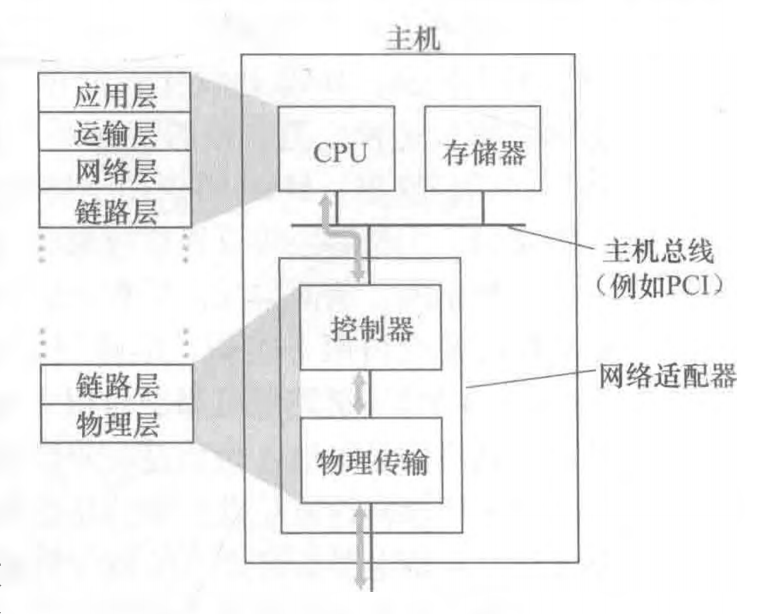

将运行链路层协议(即第2层)协议的任何设备均称为节点(node) o节点包括主机、路由器、交换机和WiFi接入点。

把沿着通信路径连接相邻节点的通信信道称为链路(link)。

考虑从无线主机之一向服务器之一发送一个数据报。该数据报将实际通过一下链路：
1. 发送主机与WiFi接入点之间的WiFi链路，
2. WiFi接入点和链路层交换机之间的以太网链路，
3. 链路层交换机与路由器之间的链路，
4. 两台路由器之间的链路，
5. 最后是交换机和服务器之间的以太网链路。
在通过特定的链路时，传输节点将数据报封装在链路层帧中，并将该帧传送到链路中。

#### 链路层提供的服务

链路层的主体部分是在网络适配器（network adapter）中实现的，网络适配器有时也称为网络接口卡（Network Interface Card, NIC）。网络适配器核心的是链路层控制器，该控制器通常是一个实现了许多链路层服务（成帧、链路接入、差错检测等）的专用芯片。因此，链路层控制器的许多功能是用硬件实现的。

在传输数据中检测差错的3种技术： P307
1. 奇偶校验（它用来描述差错检测和纠正背后隐含的基本思想）
2. 检验和方法（它通常更多地应用于运输层）
3. 循环冗余检测（它通常更多地应用在适配器中的链路层）

链路层寻址和ARP:
地址解析协议ARP:该协议提供了将IP地址转换为链路层地址的机制

适配器（即网络接口，也就是网卡）具有链路层地址。

链路层地址有各种不同的称呼：LAN地址 LAN address） 物理地址 physical address）或MAC地址（MAC address）

